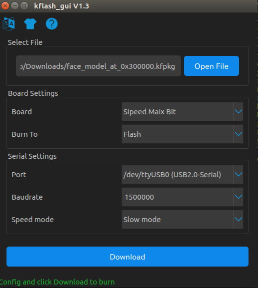

# maixbit_tutorials

Tutorials and samples for Maix Bit

This repo is based on [MaixPy official documentation](https://maixpy.sipeed.com/en/), but specialized for Maix Bit.


# Set up


## Add user in `dialout` group


```bash
sudo adduser $(whoami) dialout
```

After this command, you need to logout and login.

## Connect Maix Bit

Connect Maix Bit, LCD, camera and USB-C like below.


## Check whether Maix Bit is detected

```bash
ls -alF /dev/ttyUSB*
# /dev/ttyUSB0 might be detected.
```

## Update firmware
### Download latest firmware

Download latest firmware [MaixPy v0.3.2](https://github.com/sipeed/MaixPy/releases/) from [here](https://github.com/sipeed/MaixPy/releases/download/v0.3.2/maixpy_v0.3.2_full.bin).

### Download `kflash_gui`

Download [kflash_gui v1.3.2](https://github.com/sipeed/kflash_gui/releases) from links below.
- [Ubuntu 18.04](http://dl.cdn.sipeed.com/kflash_gui_v1.3.2_linux.tar.xz)
- [Ubuntu 16.04](http://dl.cdn.sipeed.com/kflash_gui_v1.3.2_ubuntu16.tar.xz)

### Run `kflash_gui`

```bash
cd ~/Downloads
tar xvzf kflash_gui_v1.3.2_ubuntu16.tar.xz
cd kflash_gui
./kflash_gui
```

### Burn firmware 

Set `kflash_gui` like below and burn `maixpy_v0.3.2_full.bin` into `Flash`.


## Install and set up `minicom`

### Install `minicom`

```bash
sudo apt install minicom
```

### Set up `minicom`

```bash
sudo minicom -s
```

Set up following settings.
- Serial Device: `/dev/ttyUSB0` 
- Backspace key sends: `DEL` 
- Line wtap: `Yes`

For more detailed information, read [here](https://maixpy.sipeed.com/en/get_started/power_on.html).

### Try `minicom`

```bash
minicom
```

In minicom, you can try import `MaixPy`.

```python
>>> import Maix
>>>
# no error means success.
```

You can also try LED blink test as below.

```python
from Maix import GPIO

fm.register(board_info.LED_R, fm.fpioa.GPIO0)

led_r=GPIO(GPIO.GPIO0,GPIO.OUT)
led_r.value(0)
```

### Finish `minicom`

You can finish `minicom` with  `Ctrl+A X`.

## Install `uPyLoader`

### Download `uPyLoader`

Download `uPyLoader` from [here](https://github.com/BetaRavener/uPyLoader/releases/download/v0.1.4/uPyLoader-linux).

### Install `uPyLoader`

```bash
cd ~/Downloads
mkdir ~/.local/bin
export PATH=$HOME/.local/bin:$PATH
# you can write it in ~/.bashrc
cp ./uPyLoader-linux ~/.local/bin/uPyLoader
uPyLoader
```

## Run display demo

### Clone this repo

```bash
git clone https://github.com/knorth55/maixbit_tutorials.git
```

### Upload `scripts/demo_fps_display.py`

```bash
cd maixbit_tutorials
uPyLoader
```
First click `connect` button to connect `/dev/ttyUSB0`.

Then, select `scripts/demo_fps_display.py` and click `Transfer` button below.


### Run display demo via `minicom`

Run `minicom`

```bash
minicom
```

Then, execute `demo_fps_display.py` as below.

```python
with open('demo_fps_display.py') as f:
    exec(f.read())
fps_display()
```

Now, LCD show camera RGB image with FPS.

### Run YOLO find face demo

### Clone this repo

Same as [here](https://github.com/knorth55/maixbit_tutorials/tree/master#clone-this-repo) .


### Burn `face_model_at_0x300000.kfpkg` into Maix Bit Flash

First, download `face_model_at_0x300000.kfpkg` YOLO face detection model from [here](https://github.com/sipeed/MaixPy/releases/download/v0.3.2/face_model_at_0x300000.kfpkg).

Then, burn `face_model_at_0x300000.kfpkg` by `kflash_gui` as below.

```bash
cd ~/Downloads/kflash_gui
./kflash_gui
```


### Upload `scripts/demo_find_face.py`

Same as [here](https://github.com/knorth55/maixbit_tutorials/tree/master#upload-scriptsdemo_fps_displaypy).


### Run find face demo via `minicom`

```bash
minicom
```

Then, execute `demo_find_face.py` as below.

```python
with open('demo_find_face.py') as f:
    exec(f.read())
find_face()
```

Finally, you can get face detection as below.


